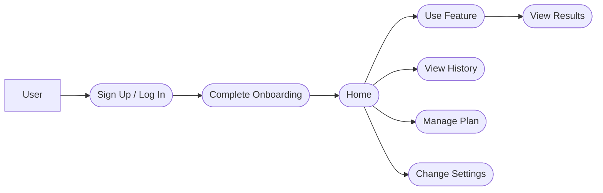
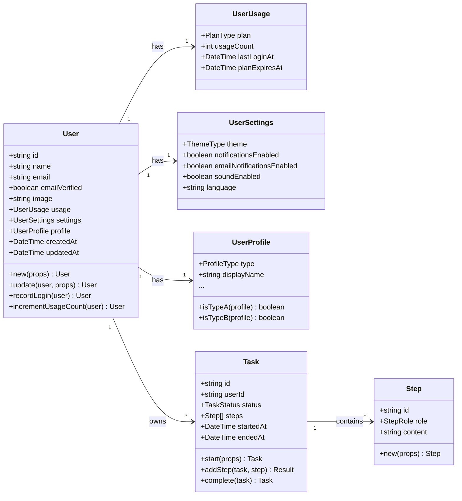
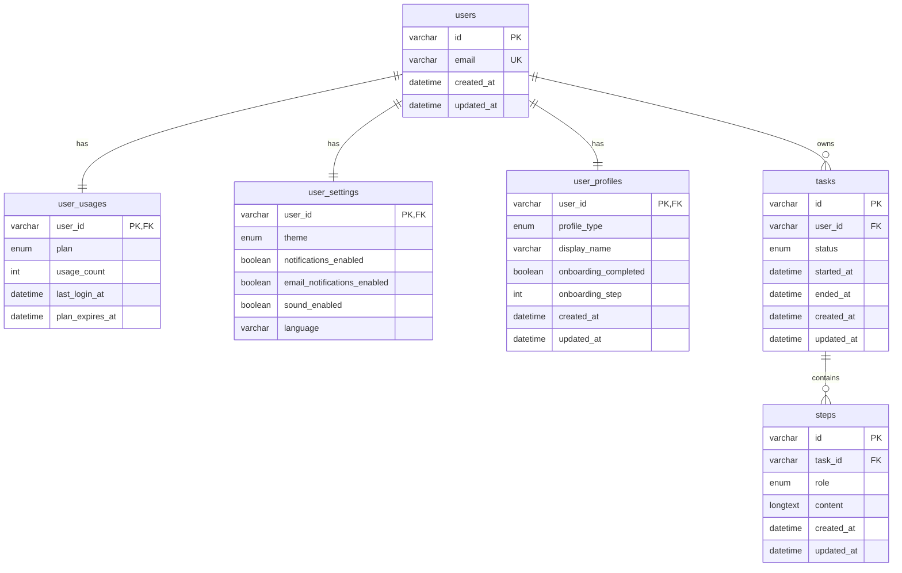

# Domain Model

## Overview

This document defines the design principles and structure for domain modeling. All application-specific domain models should be implemented following these guidelines.

## File Structure

Domain models are organized into directories by aggregate. Each aggregate clearly separates its root entity and value objects.

```
services/server/domain/
├── user/                    # User aggregate
│   ├── user.ts             # User (aggregate root)
│   ├── user-profile.ts     # UserProfile (value object, Discriminated Union)
│   ├── user-usage.ts       # UserUsage (value object)
│   ├── user-settings.ts    # UserSettings (value object)
│   └── index.ts            # Barrel file
├── [your-domain]/           # Application-specific aggregate
│   ├── [aggregate-root].ts  # Aggregate root
│   ├── [entity].ts          # Child entity
│   └── index.ts
├── billing/                 # Billing aggregate
│   ├── subscription.ts     # Subscription (aggregate root)
│   └── payment-history.ts  # PaymentHistory (entity)
├── inquiry/                 # Inquiry aggregate
│   └── inquiry.ts          # Inquiry (aggregate root)
└── email/                   # Email aggregate
    └── email.ts            # Email (entity)
```

## Domain Model Design Principles

### 1. Zod Schema First

All type definitions are derived from Zod schemas:

```typescript
// user-usage.ts
export const userUsageSchema = z.object({
  plan: planTypeSchema,
  usageCount: z.number().int().nonnegative(),
  lastLoginAt: z.date().optional(),
  planExpiresAt: z.date().optional(),
});
export type UserUsage = z.infer<typeof userUsageSchema>;
```

### 2. Companion Object Pattern for Domain Methods

Each domain model has a companion object with the same name that holds factory methods and business logic:

```typescript
// user.ts
export const User = {
  new: (props: CreateUserProps): User => { ... },
  update: (user: User, props: UpdateProps): User => { ... },
  recordLogin: (user: User): User => { ... },
  incrementUsageCount: (user: User): User => { ... },
} as const;
```

### 3. Type Guards and Utilities

When using Discriminated Unions, provide type guard functions:

```typescript
// user-profile.ts
export const UserProfile = {
  isTypeA: (profile: UserProfile): profile is TypeAProfile =>
    profile.type === "type_a",
  isTypeB: (profile: UserProfile): profile is TypeBProfile =>
    profile.type === "type_b",
  defaultUndecided: (): UndecidedProfile => ({ ... }),
} as const;
```

### 4. Immutable Updates

All update operations return new objects:

```typescript
const updatedUser = User.update(user, { displayName: "New Name" });
const completedTask = Task.complete(task);
```

## Repository Design Principles

### 1. Using drizzle-zod Schemas as DTOs

The repository layer uses Drizzle-generated `select*Schema` as DTOs to minimize manual mapping:

```typescript
import {
  type SelectTask,
  type SelectStep,
  tasksTable,
  selectStepsSchema,  // drizzle-zod schema
  stepsTable,
} from "./mysql/schema";

// Helper to convert DB task + steps to domain aggregate
const toTaskAggregate = (
  task: SelectTask,
  steps: SelectStep[],
): Task => ({
  id: task.id,
  userId: task.userId,
  // ... direct mapping
  // Use drizzle-zod schema as DTO for child entities
  steps: steps.map((row) => selectStepsSchema.parse(row)),
});

// For simple entities, use schema directly
return Ok(selectItemsSchema.parse(result.val[0]));
```

### 2. Simple Mapping

Keep helper functions that convert DB rows to domain models simple:

```typescript
// Good: Simple mapping
const toTaskAggregate = (
  task: SelectTask,
  steps: SelectStep[],
): Task => ({
  id: task.id,
  userId: task.userId,
  // ... direct mapping
  steps: steps.map(toStep),
});

// Bad: Verbose expansion
const tasks = tasksResult.val.map((task) => ({
  id: task.id,
  userId: task.userId,
  // ... enumerating the same fields every time
}));
```

### 3. Avoiding N+1 Queries

When fetching child entities of an aggregate, use `inArray` for batch retrieval:

```typescript
// Good: Batch retrieval
const taskIds = tasks.map((t) => t.id);
const stepsResult = await tx
  .select()
  .from(stepsTable)
  .where(inArray(stepsTable.taskId, taskIds));

// Group by taskId
const stepsByTaskId = new Map<string, SelectStep[]>();
for (const step of stepsResult) {
  const existing = stepsByTaskId.get(step.taskId) ?? [];
  existing.push(step);
  stepsByTaskId.set(step.taskId, existing);
}

// Bad: N+1 queries
for (const task of tasks) {
  const steps = await tx
    .select()
    .from(stepsTable)
    .where(eq(stepsTable.taskId, task.id));
}
```

### 4. Aligning Domain Models with DB Models

Avoid excessive normalization and keep domain models aligned with DB models as closely as possible:

```typescript
// Good: Flat structure matching the DB
const surveySchema = z.object({
  id: z.string(),
  taskId: z.string(),
  rating1: z.number(),
  rating2: z.number(),
  rating3: z.number(),
  rating4: z.number(),
  // ...
});

// Bad: Unnecessary normalization (converting to arrays)
const surveySchema = z.object({
  responses: z.array(
    z.object({
      questionType: z.string(),
      rating: z.number(),
    })
  ),
});
```

When backward compatibility is needed for the API, perform the conversion in the DTO layer.

## Naming Conventions

### Database
- Table names: plural snake_case (`users`, `tasks`, `orders`)
- Column names: snake_case (`user_id`, `created_at`, `task_id`)
- Foreign keys: `{referenced_table_singular}_id` (`user_id`, `task_id`, `order_id`)

### Application
- Domain models: PascalCase (`User`, `Task`, `Order`)
- Type definitions: PascalCase (`TaskStatus`, `OrderType`)
- Type aliases (for export): `{Model}Type` (`UserType`, `TaskType`)
- Variables/properties: camelCase (`taskId`, `createdAt`)
- Repositories: `{Model}Repository` (`TaskRepository`)
- Use cases: `{Model}UseCase` (`TaskUseCase`)

## Data Persistence Principles

- **Per-user storage**: All data is stored in association with a User
- **Transaction management**: Operations spanning multiple repositories are managed with transactions at the use case layer
- **Error handling with Result type**: All errors are handled uniformly using the Result type
- **Aggregate-level updates**: Each aggregate is independently managed by its repository and use case, and persisted at the aggregate level

## Aggregate Boundaries

Each aggregate is managed by its own use case and repository.

### User Aggregate
- **Root entity**: User
- **Value objects**: UserUsage, UserSettings, UserProfile (Discriminated Union)
- **Files**: `domain/user/`
- **Use case**: `UserUseCase`
- **Repository**: `UserRepository`
- **Operations**: Create, update, retrieve, delete users
- **Key methods**:
  - `User.new()` - Create user
  - `User.update()` - Update profile/settings
  - `User.recordLogin()` - Record login
  - `User.incrementUsageCount()` - Increment usage count
  - `UserProfile.isTypeA()` / `isTypeB()` - Type guards

### Billing Aggregate
- **Root entity**: Subscription
- **Child entity**: PaymentHistory
- **Files**: `domain/billing/`
- **Use case**: `BillingUseCase`
- **Repositories**: `SubscriptionRepository`, `PaymentHistoryRepository`
- **Operations**: Create/update subscriptions, manage payment history
- **Note**: Integrates with Stripe for payment processing

### Inquiry Aggregate
- **Root entity**: Inquiry
- **Files**: `domain/inquiry/`
- **Use case**: `InquiryUseCase`
- **Repository**: `InquiryRepository`
- **Operations**: Create and retrieve inquiries

### Transcript Aggregate (Cloudflare Worker)
- **Service**: `services/transcriptor/`
- **Domain models**: `TranscriptParams`, `TranscriptStage`, `TranscriptKey`
- **Use case**: `TranscriptUseCase` (`fetch`, `fetchAndSave`)
- **Repository**: `TranscriptRepository` (R2 storage)
- **Infrastructure**: `TranscriptFetcher` (Cloudflare Container + yt-dlp)
- **Orchestration**: `TranscriptWorkflow` (Cloudflare Workflow)
- **Stages**: `raw` -> `chunked` -> `proofread`
- **Storage path**: `transcripts/{stage}/{videoId}/{lang}.json`
- **Shared package**: `@vspo/errors` (Result type)

## Use Case Diagram (Example)



## Class Diagram (Example)



## ER Diagram (Example)



## Enums (Examples)

### PlanType
- `free` - Free plan
- `basic` - Basic plan
- `pro` - Pro plan
- `enterprise` - Enterprise plan

### ThemeType
- `light` - Light mode
- `dark` - Dark mode
- `system` - Follow system setting

### TaskStatus
- `in_progress` - In progress
- `completed` - Completed
- `failed` - Failed

### StepRole
- `system` - System
- `user` - User

## API Endpoints (Examples)

### User API
- `GET /me` - Get user information (includes usage, settings, profile)
- `PUT /me` - Update user information (partial updates to usage, settings, profile)
- `GET /me/dashboard` - Get dashboard data

### Task API
- `POST /tasks` - Start a task
  - Request: `{ type, config? }`
  - Response: `{ id, userId, status, steps, startedAt, ... }`
- `GET /tasks/{taskId}` - Get a task
- `POST /tasks/{taskId}/steps` - Add a step
  - Request: `{ role, content }`
- `POST /tasks/{taskId}/completion` - Complete a task
